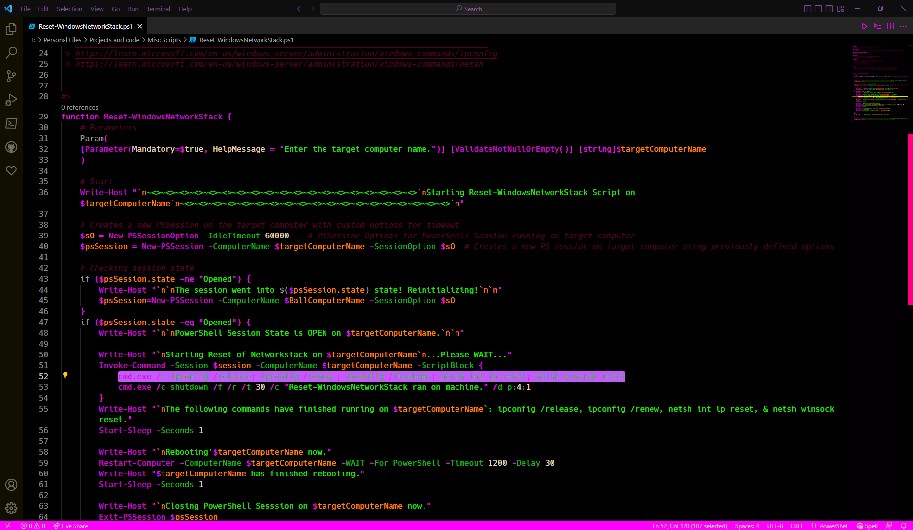

<!-- PROJECT LOGO -->
 

  

  <h3 align="center">Dark Rain - dark.uıɐɹ</h3>

  
A dark Color Theme for Visual Studio Code - deep blacks with vivid bursts of green, pink, and blue.
     
  

<!-- ABOUT THE PROJECT -->
## About The Project

### VS Code Extension

### What's in the folder

* This folder contains all of the files necessary for your color theme extension.
* `package.json` - this is the manifest file that defines the location of the theme file and specifies the base theme of the theme.
* `themes/dark.uıɐɹ-color-theme.json` - the color theme definition file.

### Get up and running straight away

* Press `F5` to open a new window with your extension loaded.
* Open `File > Preferences > Color Themes` and pick your color theme.
* Open a file that has a language associated. The languages' configured grammar will tokenize the text and assign 'scopes' to the tokens. To examine these scopes, invoke the `Developer: Inspect Editor Tokens and Scopes` command from the Command Palette (`Ctrl+Shift+P` or `Cmd+Shift+P` on Mac).

### Make changes

* Changes to the theme file are automatically applied to the Extension Development Host window.

### Adopt your theme to Visual Studio Code

* The token colorization is done based on standard TextMate themes. Colors are matched against one or more scopes.

To learn more about scopes and how they're used, check out the [color theme](https://code.visualstudio.com/api/extension-guides/color-theme) documentation.

### Install the extension

* To start using your extension with Visual Studio Code copy it into the `<user home>/.vscode/extensions` folder and restart Code.
* To share your extension with the world, read on https://code.visualstudio.com/docs about publishing an extension.

(<a href="#readme-top">back to top</a>)

